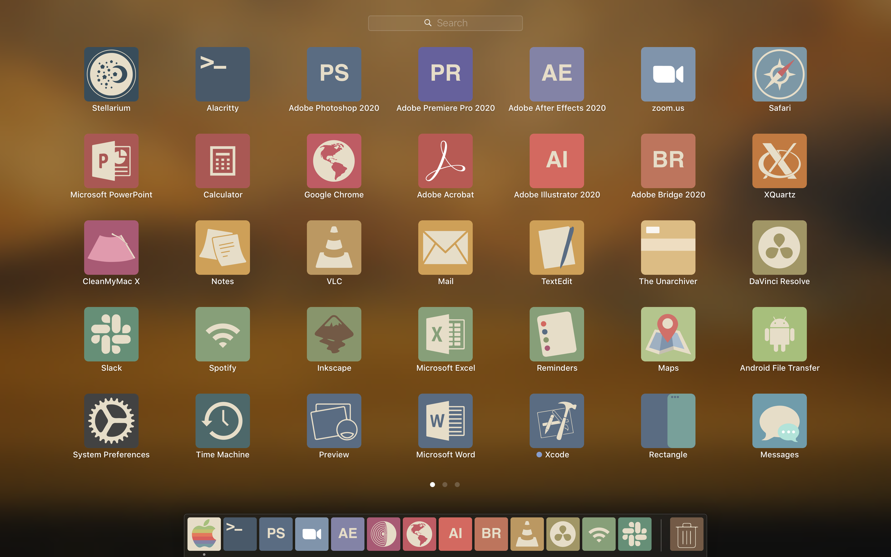

A sleek set of retro icons for MacOS
-------------------------------------
&nbsp;


#

Proceed with caution! Changing icons of MacOS requires certain system restrictions to be disabled. We begin by disabling 
System Integrity Protection, which enables mac system icons to be changed. Reboot your mac into recovery mode by holding 
down `⌘R` while the system is being rebooted. Enter your system password and then select `Utilities > Terminal`

```
csrutil disable
```

Now reboot your mac once again

To be able to change some obstinate icons, enter the following commands into the terminal

```
sudo mount -uw /
killall Finder
```

After changing all the icons, remember to re-enable System Inegrity Protection, by rebooting your mac

```
csrutil enable
```

This is what your launchpad will look like once all the icons have been replaced




### Download Instructions

Download the icons with the following [link](https://github.com/amanchokshi/retro-icons/archive/master.zip), or clone this repository

```
git clone https://github.com/amanchokshi/retro-icons.git

tree retro-icons -d

retro-icons
├── docs
├── icns
├── original
├── scripts
└── templates
    ├── pngs
    └── svgs


cd retro-icons
```

MacOS uses icon files in the `.icns` format. All icons available with this icon packs are available in the `retro-icons/icns` folder.
The `original` folder contains system icons, in case you want to revert to the back to the default icons. `templates` contains
`svg` and `png` files which can be used as templates to modify icons to your taste. It also contains `palette.ai` an Adobe Illustrator
file with a color palette and an icon shape template. The `scripts` folder contains `python` scripts used to convert `svg` file to `pngs`
and `icns`.

### Application Icons

Changing application icons is an quick process. Open your `Applications` folder. Right click on an app you want to modify and select `get info`


<p float="left">
  
  
</p>

The icon outlined in orange is the one which needs to be replaced. Open the `retro-icons/icns` folder, find the matching icon, and drag in over
the orange box until a green ⊕ symbol appears. You may need to enter your password to finalise the change of the icon.

This method will work for most apps. Some system icons such and the `finder`, `calendar` & the `trash can` will require more love.

The icons in the dock may not immediately reflect the changes you've made. To refresh the dock, open a terminal `Utilities > Terminal`
and enter

```
killall Dock
```


#### Ooops, I want the original icons back
In the unlikely scenario where you'd like to revert to the original icon, right click on the icon and get info. Select the icon as
outlined in the figure above, and hit `delete` on your keyboard. This will delete the custom icon, revealing the original icon


### System Icons

These icons can be more stubborn and will require more attention

##### Finder & Trash
The finder and trash icons live deep within the bowels of the operating system. They can be accessed with the following incantation in a terminal

```
open /System/Library/CoreServices/Dock.app/Contents/Resources/
```

Or, open the Finder and enter `⌘ + ⇧ + G` or `command+shift+G` to bring up the Go To Folder prompt where the following path may be entered

```
/System/Library/CoreServices/Dock.app/Contents/Resources/
```

The following files will need to be replaced

```
.
├── finder.png
├─── finder@2.png
├── trashempty.png
├── trashempty.png
├── trashempty2.png
├── trashempty2@2.png
├── trashempty@2.png
├── trashfull.png
├── trashfull2.png
├── trashfull2@2.png
└── trashfull@2.png
```

Custom versions of thes icons can be found in `retro-icons/icns/Finder` & `retro-icons/icns/Trash`. Drag and drop them into the `Resources` folder,
making sure to check `replace` files in a prompt pops up. You may need to enter a password before this can be completed. If at a later stage,
you'd like to revert to the original icons, follow the above steps, but use the original icons which I've provided in the `retro-icons/original` folder.

##### Folder & Drives

Replacing the default icons of the MacOS folders, Hard Drives & SD cards requires a process similar to that described above.
The system icons live in one of the following  three folders. Open them with the terminal using the `open` command, or use
`⌘ + ⇧ + G` in the finder.


```
/System/Library/CoreServices/CoreTypes.bundle/Contents/Resources/
/System/Library/Extensions/IOStorageFamily.kext/Contents/Resources/
/System/Library/Extensions/IOSCSIArchitectureModelFamily.kext/Contents/Resources
```

The custom icons live in `retro-icons/Folder` & `retro-icons/Drives`. You can drag and drop them over the system icon, select `replace` and
enter your password to replace the icon.

##### Calander Icon

The calendar icon is particularly problamatic, since it is dynamic, and changes every day to display the current date. To change the icon,
right click on the `calender.app` and select `show package contents`. Navigate to `Contents > Resources`. Find `App-empty.icns` and `App.icns`
and replace them with corresponding icons found in `retro-icons/icns`. Navigate further to `Calendar.docktileplugin > Contents > Resources`
and replace `App-empty.icns`

Now, our custom calender icon will update everyday to show the date, in our custom `retro` style.

### Bonus Tips
Modify these icons and make them your own!

This repository contains the intermediate vector files which I used to create these icons. These can serve as the base for modifications, or as an inspiration
to create something new and awesome. `retro-icons/templates/palette.ai` is an Adobe Illustrator file which contains the color palette which I used for these
icons and well as a template for the icon shape.

`retro-icons/tempates` contains `svgs` and `pngs` folders. The svgs folder has vector graphics for each of the icons. These can be opened
in Illustrator to modify the design and colors. The pngs folder contains pngs of my custom `folder` icons. You can use Photoshop to modify their colors and design.

#### Creating icns files

The `retro-icons/scripts` folder contains `python` scripts which can convert `.svg` & `.png` files in MacOs `.icns` icon files.

svg files are converted to png files using inkscape, which can be installed with

```
brew cask install inkscape
```

The `svg2png.py` script converts a batch of pngs in a `--svg_dir` folder to pngs which will be saved to an output folder specified using
the `--out_dir` flag.

Note: these scripts require python versions above 3.6
```
# See all options with

python svg2png.py --help

# Example
python svg2png.py --svg_dir=./svgs --out_dir=./pngs
```

The above code will convert all svg files in the `./svg` folder to png files which will be saved to `./pngs`

Similary, the `png2icns.py` will convert a set of png file to mac icns files

```
# See all options with

python png2icns.py --help

# Example
python png2icns.py --png_dir=./svgs --out_dir=./icns
```

### Contributing

These icons were made to suit my needs. My OCD wouldn't let me stop till I could replaced all my icons, which may leave
you a couple of apps short of a full set, with no suitable beautiful `retro-icon` to replace. I undertand your plight!
Open an issue on this github page with the icon you're missing and I'm happy to make you a super cool one ✨🌙✨

I'd love to see any new icons you come up with, and make them a part of this repository. Submit a pull request and I'm happy
to add your creations to this repository, as long as they match the aesthetic style!

To get in touch, email me at [Aman Chokshi](mailto:achokshi@student.unimelb.edu.au?subject=[GitHub]%20Retro%20Icons)
